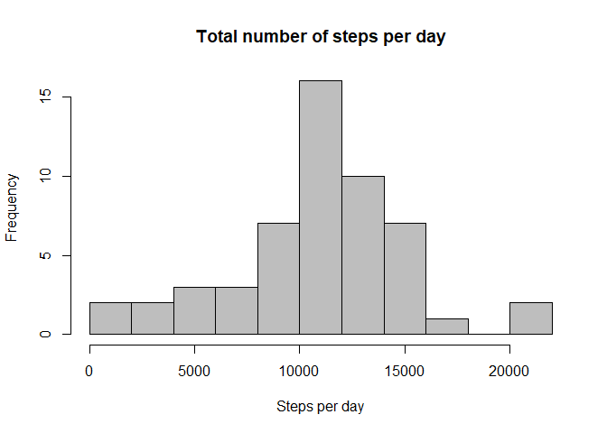

# Reproducible Research: Peer Assessment 1


## Activity Monitoring Data Analisys


## Loading and preprocessing the data


```r
## reading and processing data to obtain date and time in appropriate format

## reading data
d <- tbl_df(fread("./activity.csv", stringsAsFactors=FALSE, na.strings = "NA"))

## add zeros to the left
time <- sprintf("%04.0f", d$interval)
## change class 
time <- as.POSIXct(time, format='%H%M')
## keep hours and minutes only
time <- substr(time, 12, 16)

## combining date and time 
datetime <- paste(d$date, time, sep = " ")
d$dt <- as.POSIXct(datetime, format = "%d/%m/%Y %H:%M")
```

## What is mean total number of steps taken per day?

1. Making a histogram

```r
## What is mean total number of steps taken per day?
## remove NA for this part of the assignment
dd <- d[complete.cases(d),]

## Compute total number of steps taken per day
stepsday <- aggregate(steps ~ date, dd, sum)

## Plot histogram of number of steps per day
hist(stepsday$steps, main = "Total number of steps per day", xlab = "Steps per day", breaks = 10,col = "gray")
```

<!-- -->


```r
summary(stepsday)
```

```
##      date               steps      
##  Length:53          Min.   :   41  
##  Class :character   1st Qu.: 8841  
##  Mode  :character   Median :10765  
##                     Mean   :10766  
##                     3rd Qu.:13294  
##                     Max.   :21194
```

```r
## mean number of steps per day
a <- round(mean(stepsday$steps),0)
## and the median
b <- round(median(stepsday$steps),0)
```

2. The mean total number of steps taken per day is 10766 and the median is 10765.


## What is the average daily activity pattern?


```r
## What is the average daily activity pattern?
## Compute total number of steps taken per interval
avgstepsinterval <- aggregate(steps ~ interval, dd, mean)
## change name of the second column in avgstepsinterval
names(avgstepsinterval)[2] <- "avgsteps"
```
1. Plot of average steps taken per interval

```r
## 1. plot of average steps taken per interval
plot(avgstepsinterval$interval, avgstepsinterval$avgsteps, type = "l",
     main="Average number of steps per Interval", xlab="Intervals", 
     ylab="Average number of steps")
```

<!-- -->

2. Which 5-minute interval, on average across all the days in the dataset, 
contains the maximum number of steps?


```r
## 2.Which 5-minute interval, on average across all the days in the dataset, 
##   contains the maximum number of steps?
## calculate where the interval is
maxindex <- which.max(avgstepsinterval$avgsteps)
## retrieve interval it from the data
c <- sprintf("%04.0f",avgstepsinterval$interval[maxindex])
c <- substr(as.POSIXct(c, format='%H%M'),12,16)
```

The 5-minute interval, on average across all the days in the dataset, 
that contains the maximum number of steps is 08:35.


## Imputing missing values

1. Calculate total number of rows with NA's


```r
## Imputing missing values
## 1. calculate total number of rows with NA's
cc <- nrow(d[!complete.cases(d),]) 
```

The total number of rows containing missing values is 2304.

2. Missing values will be filled with the mean for the respective 5-minute interval.


```r
## 2. Filling NA's with the mean for the respective 5-minute interval.
## add a new column to dataframe with the avg steps per interval
## by merging activity data with avgstepsinterval
d <- merge(d, avgstepsinterval, by="interval")
## rearrange to chronological order
d <- arrange(d, dt)
##  and replace NA's
for (i in 1:length(d$steps)){
    if(is.na(d$steps[i])){
        d$steps[i] <- round(d$avgsteps[i],0)
    }
}
```

3. New data set equal to the orinal one but with missing data filled in


```r
## 3. New data set equal to the orinal one but with missingdata filled in
d <- d[,c(2,3,1)]
head(d)
```

```
##   steps       date interval
## 1     2 01/10/2012        0
## 2     0 01/10/2012        5
## 3     0 01/10/2012       10
## 4     0 01/10/2012       15
## 5     0 01/10/2012       20
## 6     2 01/10/2012       25
```

4. Make a histogram of the total number of steps taken each day


```r
## calculations as before
## Compute total number of steps taken per day
stepsday <- aggregate(steps ~ date, d, sum)
```


```r
## Plot histogram of number of steps per day
hist(stepsday$steps, main = "Total number of steps per day", 
     xlab = "Steps per day", breaks = 10,col = "gray")
```

<!-- -->

Mean and median of thetotal number of steps taken per day


```r
summary(stepsday)
```

```
##      date               steps      
##  Length:61          Min.   :   41  
##  Class :character   1st Qu.: 9819  
##  Mode  :character   Median :10762  
##                     Mean   :10766  
##                     3rd Qu.:12811  
##                     Max.   :21194
```

```r
## mean number of steps per day
e <- round(mean(stepsday$steps),0)
## and the median
f <- round(median(stepsday$steps),0)
```

The mean total number of steps taken per day is 10766 and the median is 10762.

In the way that missing values were imputed, with the daily average for the given period there was no change to the rounded mean before 10766 and after 10766
and a small change to the median 10765 and 10762.


## Are there differences in activity patterns between weekdays and weekends?

Weekdays and weekends analisys with imputed data

1. Create a factor variable as to whether the data belongs to
a weekend or weekday


```r
## Weekdays and weekends analisys with imputed data
## 1. create a logical coloumn as to whether the data belongs to
## a weekend or weekday

d$dt <- as.POSIXct(datetime, format = "%d/%m/%Y %H:%M")
d$weekday <- weekdays(d$dt)

for (i in 1:length(d$weekday)){
    if(d$weekday[i] == "Saturday" || d$weekday[i] == "Sunday"){
        d$weekday[i] <- "weekend"
    }
    else
        d$weekday[i] <- "weekday"
}

d$weekday <- as.factor(d$weekday)
```

2. Compute total number of steps taken per interval and type of day
and plot them separately


```r
## 2. Compute total number of steps taken per interval and type of day
## and plot them separately
avgstepsinterval <- aggregate(steps ~ interval + weekday, d, mean)
names(avgstepsinterval)[3] <- "avgsteps"
```


```r
g <- ggplot(avgstepsinterval, aes(interval, avgsteps)) +
    geom_line( aes(colour = weekday)) +
    facet_grid(weekday ~ ., scales="fixed", space="fixed") +
    labs(x="Interval", y="Average number of steps") +
    ggtitle("Average number of steps per Interval and day type")
print(g)
```

<!-- -->

There are small differences to weekday and weekend average number of steps. 
During weekends the average is more evenly spread though the day, with a milder peak
in comparison to weekdays before 09:00 and slightly higher average around 20:00.


